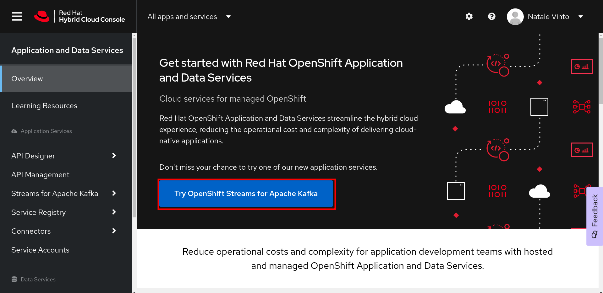

# Kafka Messenger: Knative Eventing + Kafka Demo

Welcome to the repository of the [The Red Hat Cloud way: Event-driven, serverless, distributed cloud services to support modern apps](https://events.experiences.redhat.com/widget/redhat/sum22/SessionCatalog22/session/1641393269992001GRAh) session demo presented at [Red Hat Summit 2022](https://www.redhat.com/en/summit).

The aim of this demo is to show how to create and deploy cloud-native event-driven serverless workloads for Kubernetes at ease using the [Red Hat Hybrid Cloud Console](https://console.redhat.com). 

The demo flow is composed by 4 steps:

* Creating an [Apache Kafka](https://kafka.apache.org/) cluster created in cloud with [Red Hat OpenShift Streams for Apache Kafka]( https://console.redhat.com/application-services/streams/overview). You can try this service at no cost for 48 hours.
* Using free cloud Kubernetes environment with [Red Hat OpenShift Developer Sandbox](https://developers.redhat.com/developer-sandbox). The service is free for 30 days and renewable at no cost.
* Creating with [OpenShift Serverless](https://www.redhat.com/en/technologies/cloud-computing/openshift/serverless) a [Knative Service](https://knative.dev/docs/serving/) for a backend application. Connecting this app to the cloud Kafka cluster using [Knative Eventing](https://knative.dev/docs/eventing/) and [CloudEvents](https://cloudevents.io). Creating and connecting to the Kafka cluster with the OpenShift Web Console a standalone Java app simulating messages from IoT devices.
* Auto-scale the backend app proportionally to the load of Kafka messages, from zero to N.

You can see the overall architecture below:

## Demo flow

Follow the steps below to implement and try the demo yourself!

### Red Hat Hybrid Cloud Console

Get a free account on https://console.redhat.com to start trying and using Red Hat Cloud Services.

Once you registered, you have access to the main dashboard listing all your services and clusters.

### Managed Kafka

From the left-side menu, click to **Application and Data Services**. Then click to **Try OpenShift Stream for Apache Kafka**.

Then **Create Kafka instance**

Add a name for the cluster in the **Name** field, leave default options and click to **Create instance**.

The cluster will be ready in a few minutes, and the you should see it listed in **Ready** status as the following:

